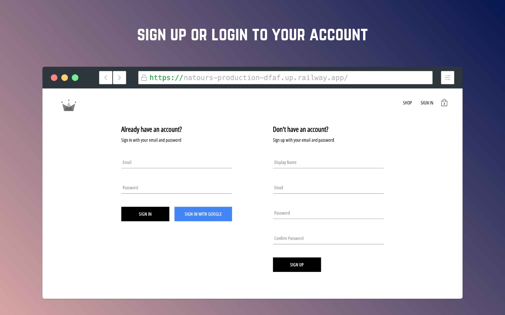
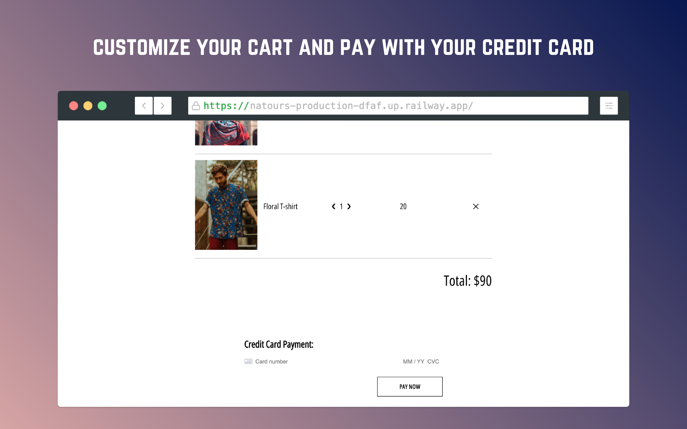

  

<h3 align="center">Crwn Clothing</h3>

An e-commerce website with features like Google sign-in, Stripe payments, and seamless checkout  

## Built With

* ![React]
* ![Typescript]
* ![Styled]
* ![Firebase]
* ![Redux]
* ![Stripe]

## Screenshots

  
  
  
  

## Getting Started
* Try the website using the hosted version from [here](https://bejewelled-unicorn-8a3b00.netlify.app/)   

[React]: https://img.shields.io/badge/React-black?style=for-the-badge&logo=React&logoColor=61DAFB
[Html]: https://img.shields.io/badge/html5-E34F26?style=for-the-badge&logo=html5&logoColor=white
[CSS]: https://img.shields.io/badge/css3-1572B6?style=for-the-badge&logo=css3&logoColor=white
[JavaScript]: https://img.shields.io/badge/javascript-F7DF1E?style=for-the-badge&logo=javascript&logoColor=grey
[Typescript]: https://img.shields.io/badge/Typescript-3178C6?style=for-the-badge&logo=Typescript&logoColor=white
[Styled]: https://img.shields.io/badge/styledcomponents-DB7093?style=for-the-badge&logo=styledcomponents&logoColor=white
[Firebase]: https://img.shields.io/badge/firebase-DD2C00?style=for-the-badge&logo=firebase&logoColor=white
[Redux]: https://img.shields.io/badge/redux-764ABC?style=for-the-badge&logo=redux&logoColor=white
[Stripe]: https://img.shields.io/badge/Stripe-008CDD?style=for-the-badge&logo=Stripe&logoColor=white
